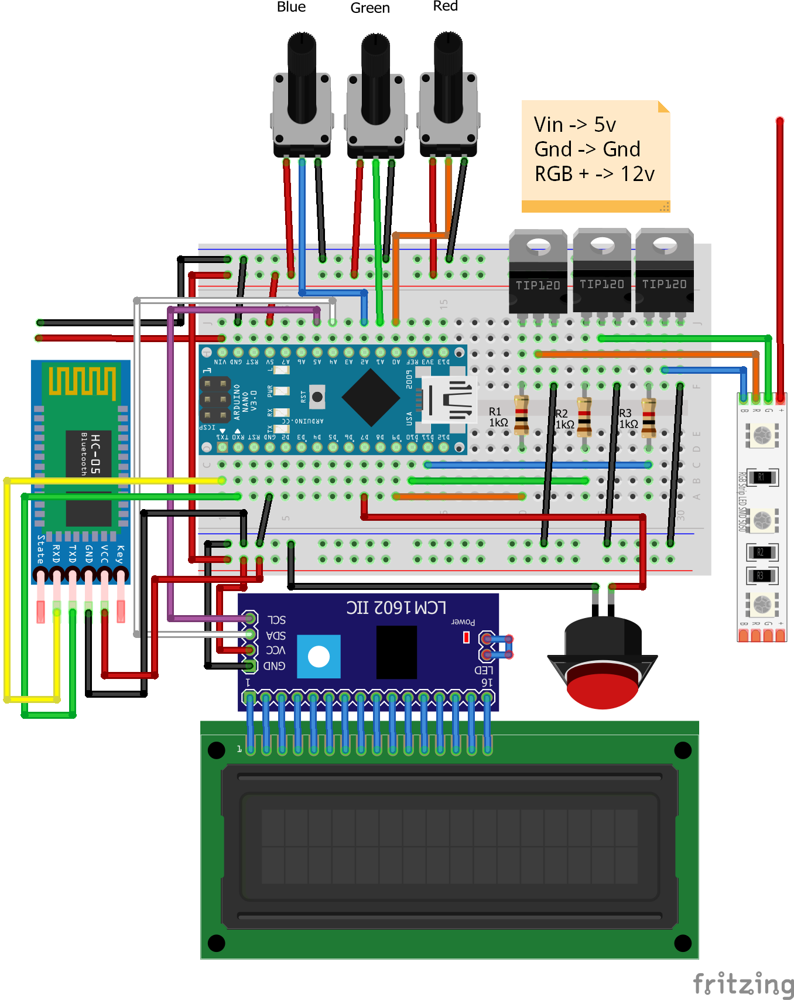

# PcRGB
 This work is licensed under a <a rel="license" href="http://creativecommons.org/licenses/by/2.0/">Creative Commons Attribution 2.0 Generic License</a>

Your gaming PC doesn't have RGB?! Just buy some! But what if your motherboard doesn't support it either? Well... Build your own controller!

## The project Briefly 
This tutorial shows you how you can create your own RGB controller for use anywhere in your house. Including your gaming PC with little if ANY cost.
We are using Arduino and some LED strips or fans.

**There is a Bluetooth controlled version coming to which you will be able to upgrade from any of the current versions.**

## Required matterials

The average total cost is around **24 dollars** including not required materials.

The list of all materials can be found in [Required Materials.xlsx][MaterialList]

## Circuit
**Animated**|**Schematic**  
------------|-------------
|

You can see a higher resolution version of the [**Schematic**][schem] and [**Animated Schematic**][schemAnim] or download the [**Fritzing (.fzz)**][Fritzing] file to edit them.

If you decide to not use some of the unnecessary parts just exclude them and their wires. If you upload the corresponding code for your changes everything should work just fine.

## Code 
After building the circuit it is time to test it.

Locate the code that corresponds to the parts you have excluded (if any), connect to the Arduino via USB, select the port the Arduino is connected, change board to Arduino nano and the Processor (according to your board. I sugget figuring out which one you have with trial and error. Then, upload the sketch.

### Choose the correct code to load
| Code for component combinations | Features |
| -----|----- |
| [PcRGB_all][codeall]<ul><li>- [x] LCD</li><li>- [x] Potentiometers</li><li>- [x] Button</li></ul> | <ul><li>- [x] Display</li><li>-[x] Manual</li><li>- [x] Breath<ul><li>- [x] Software Control</li><li>- [x] Manual Control</li></ul></li><li>- [x] Color Wheel (Rainbow Effect)</li><li>- [ ] Bluetooth Control</li></ul> |
| [PcRGB_noLCD][codenoLCD]<ul><li>- [ ] LCD</li><li>- [x] Potentiometers</li><li>- [x] Button</li></ul>| <ul><li>- [ ] Display</li><li>-[x] Manual</li><li>- [x] Breath<ul><li>- [x] Software Control</li><li>- [x] Manual Control</li></ul></li><li>- [x] Color Wheel (Rainbow Effect)</li><li>- [ ] Bluetooth Control</li></ul> |
| [PcRGB_noLCD_noPotentiometers][codenoLCDnoP]<ul><li>- [ ] LCD</li><li>- [ ] Potentiometers</li><li>- [x] Button</li></ul> | <ul><li>- [ ] Display</li><li>-[ ] Manual</li><li>- [x] Breath<ul><li>- [x] Software Control</li><li>- [ ] Manual Control</li></ul></li><li>- [x] Color Wheel (Rainbow Effect)</li><li>- [ ] Bluetooth Control</li></ul> |
| [PcRGB_singleMode][codesingle]<ul><li>- [ ] LCD</li><li>- [ ] Potentiometers</li><li>- [ ] Button</li></ul> | <ul><li>- [ ] Display</li><li>-[ ] Manual</li><li>- [x] \*Breath<ul><li>- [x] Software Control</li><li>- [ ] Manual Control</li></ul></li><li>- [x] \*Color Wheel (Rainbow Effect)</li><li>- [ ] Bluetooth Control</ul> \*You will have to choose between these effects each time you load the code |
| [PcRGB_Bluetooth][codebluetooth]<ul><li>- [ ] LCD</li><li>- [ ] Potentiometers</li><li>- [ ] Button</li></ul> | <ul><li>- [ ] Display</li><li>-[x] \*Manual</li><li>- [ ] Breath<ul><li>- [ ] Software Control</li><li>- [ ] Manual Control</li></ul></li><li>- [x] \*Color Wheel (Rainbow Effect)</li><li>- [ ] Bluetooth Control</ul> \*You can only change modes with your android device over bluetooth|

## Installation
After you finish testing you can add more RGB fans or Led strips in series or parallel. You can now remove the cover of the back of your breadboard and stick it in one 2,5 inch drive bay of your computer. Or, if you are not using it in a computer, you can just place it wherever you want to. A trick of mine was to get some cables out of the PCIe ports and add more RGB to my desk that was synchronised with my pc. 

If you are using the full or no LCD versions I recomend either making a stand with the three potentiometers and the LCD outside the PC or drilling holes on the top of your case and then placing the potentiometers and the LCD with their nuts and hot glue respectively. You can even add potentiometer knobs to make them look more professional.

## Demo
**Demo Image 1**|**Demo Image 2**  
------------|-------------
|

[MaterialList]: <https://github.com/nickiliopoulosedu/PcRGB/raw/main/Required%20Materials.xlsx>
[schem]: <https://github.com/nickiliopoulosedu/PcRGB/raw/main/Images/Schematics_schem.png>
[schemAnim]: <https://github.com/nickiliopoulosedu/PcRGB/raw/main/Images/Schematics_graphical.png>
[Fritzing]: <https://github.com/nickiliopoulosedu/PcRGB/raw/main/Fritzing/Schematics.fzz>
[codeall]: <https://github.com/nickiliopoulosedu/PcRGB/tree/main/Code/Arduino/PcRGB_all>
[codenoLCD]: <https://github.com/nickiliopoulosedu/PcRGB/tree/main/Code/Arduino/PcRGB_noLCD>
[codenoLCDnoP]: <https://github.com/nickiliopoulosedu/PcRGB/tree/main/Code/Arduino/PcRGB_noLCD_noPotentiometers>
[codesingle]: <https://github.com/nickiliopoulosedu/PcRGB/tree/main/Code/Arduino/PcRGB_singleMode>
[codebluetooth]: <https://github.com/nickiliopoulosedu/PcRGB/tree/main/Code/Arduino/PcRGB_bluetooth>
